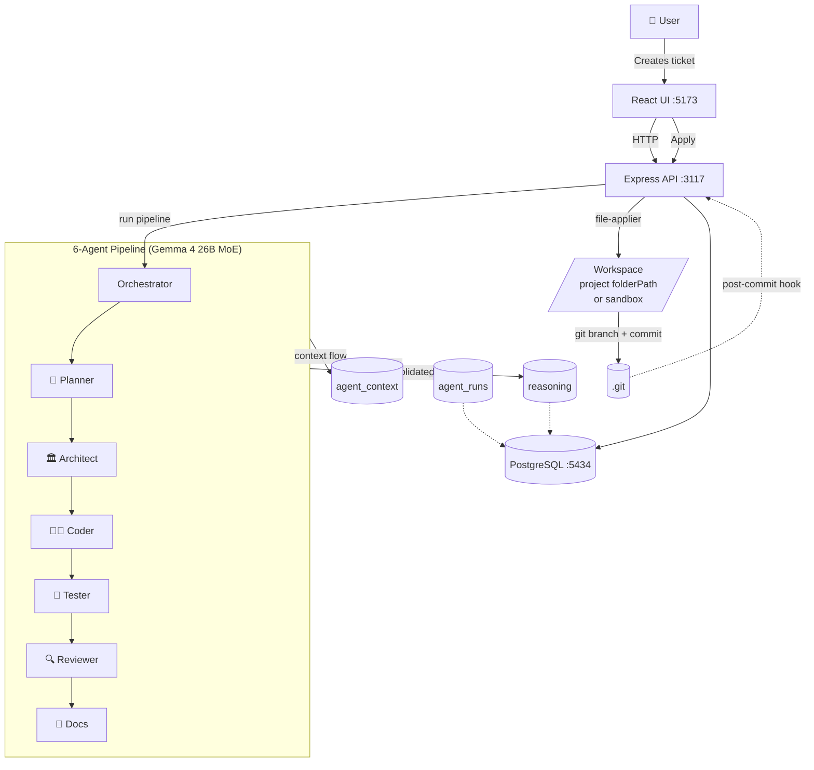

# Decidr Code

**A 6-agent AI pipeline that doesn't just write code — it shows its work.**

Decidr Code combines a Jira-style kanban board with a multi-agent AI pipeline running on **Gemma 4** (open-weight, Apache 2.0). Every ticket flows through specialist agents — Planner, Architect, Coder, Tester, Reviewer, Docs — that each emit a slice of a structured decision tree. You see *what* was built and *why*, plus you can apply the AI's code to a real git branch with one click.

---

## What It Does

- **Kanban board** — Manage work items across Backlog → Todo → In Progress → Review → Done
- **Multi-agent pipeline** — Each ticket runs through 6 specialist Gemma 4 agents that produce structured artifacts (plans, designs, code, tests, reviews, docs)
- **Decision trees** — Every pipeline run consolidates the agents' reasoning into a typed tree (`problem`, `investigation`, `discovery`, `root_cause`, `decision`, `chosen`, `rejected`, `ruled_out`) — visible on the Reasoning tab
- **One-click Apply** — Click "Apply Coder Output" and the agent's files land on a `DC-XXX/<slug>` git branch with a real commit. Sandbox by default, project workspace if linked.
- **Git integration** — Branches and commits auto-link to tickets via the `DC-XXXXX/feature-name` convention
- **Pipeline state guards** — Server-side guard rejects accidental re-fires; UI gates the Run button while running; `/api/pipeline/reset/:id` recovers stuck states
- **MCP-first** — Works natively inside Cursor, Claude Code, Windsurf, and any MCP-compatible editor
- **File bridge** — Drop a JSON file into `.decidr/inbox/` to create a ticket from any tool or script
- **Hook system** — Event-driven bash automation (TicketCreated, TicketMoved, PostSave, SessionStart, post-commit, post-checkout, post-merge)
- **Local-first** — Postgres on your machine, no cloud dependency, your code never leaves your laptop

---

## High-level Architecture



---

## Tech Stack

| Layer | Technology |
|-------|-----------|
| Desktop shell | Tauri v2 (Rust) |
| Frontend | React 18 + Vite + Tailwind CSS |
| State | Zustand |
| API | Express 4 (REST, port 3117) |
| Database | PostgreSQL 16 via Drizzle ORM |
| AI | Gemma 4 (26B MoE) via Google Gemini API |
| Editor integration | Model Context Protocol (MCP) |
| Language | TypeScript throughout |

Tauri is used instead of Electron — the app binary is 5–10 MB vs 150 MB+ and uses the system webview.

---

## Project Structure

```
decidr-code/
├── packages/
│   ├── core/          # Headless engine — schema, repositories, services, types
│   ├── server/        # Express REST API
│   ├── mcp/           # MCP server for editor integration
│   ├── web/           # React + Vite frontend
│   ├── file-bridge/   # .decidr/ folder watcher for editor-agnostic integration
│   └── vscode-ext/    # VS Code / Cursor extension scaffold
├── src-tauri/         # Tauri v2 native shell (Rust)
├── sidecar/           # Node.js sidecar (compiled to binary via pkg)
├── hooks/             # Bash hook scripts for git and app events
├── agents/            # AI agent definitions (bug-triager, code-reviewer, etc.)
├── docs/              # Interactive documentation site
└── tasks/             # Session tracking (changelog, todo, lessons)
```

### Core Package Architecture

```
User action
  └── React frontend (Zustand store)
        └── REST API client → Express :3117
              └── Route → Service → Repository
                    └── Drizzle ORM → PostgreSQL :5434
```

The `core` package is headless — it has no HTTP or UI dependencies. Both the REST server and the MCP server import directly from `core`, keeping business logic in one place.

---

## Features in Detail

### Kanban Board

Five columns: **Backlog → Todo → In Progress → Review → Done**. Tickets are created with a unique ID in the format `DC-XXXXX`. Each ticket carries a title, description, priority (critical/high/medium/low), and tags.

### AI Reasoning Trees

Clicking **Process Ticket** sends the ticket to Gemma 4, which returns:

- A **decision tree** with typed nodes: `problem`, `investigation`, `discovery`, `root_cause`, `decision`, `chosen`, `rejected`, `ruled_out`
- A **confidence score** (0–1) on the quality of the reasoning
- **Execution logs** with per-step timing
- A **summary** of the conclusion

Processing phases tracked: Intake → Scan → Research → Analysis → Architecture → Alternatives → Implementation → Edge Cases → Validation

### Why Gemma 4

Decidr Code's 7-agent pipeline (Planner → Architect → Coder → Tester → Reviewer → Debugger → Docs) runs on **Gemma 4 26B MoE** via the Google Gemini API. Gemma 4 is open-weight under **Apache 2.0**, which means:

- The pipeline can be redeployed on a self-hosted Gemma instance for teams that can't send code to a third-party API.
- Commercial use, modification, and redistribution are allowed without royalties.
- The decision-tree audit trail and the model that produced it are equally portable.

The MoE variant gives strong reasoning quality with only 4B active parameters per token, which keeps latency manageable when running 7 sequential agents per ticket.

### End-to-end workflow

```
1. User files a ticket on the kanban board
   ↓
2. Click "▶ Run Pipeline" on the Pipeline tab
   ↓
3. Gemma 4 agents run in sequence (~5–7 minutes)
     Planner   ──▶ tasks + acceptance criteria
     Architect ──▶ design note, file structure, patterns
     Coder     ──▶ full file contents + commit message
     Tester    ──▶ test files + coverage targets
     Reviewer  ──▶ score + per-file issues
     Docs      ──▶ updated README, changelog
   ↓
4. Reasoning tab shows a 6-branch consolidated decision tree
   ↓
5. Click "✓ Apply for real" on the Apply Coder Output panel
     • Files written to /tmp/decidr-output/<ticketId>/  (sandbox)
       OR to project.folderPath if a project is linked
     • Sandbox auto-init as a git repo on first apply
     • DC-<id>/<slug> branch checked out
     • Files committed with the Coder's commit message
   ↓
6. Branch + commit registered in Decidr's git tables → visible on the Git tab
   ↓
7. Open the workspace path, inspect the diff, run the code
```

### Apply safety guarantees

The file-applier in [`packages/core/src/workspace/file-applier.ts`](packages/core/src/workspace/file-applier.ts) refuses to:

- Write to absolute paths or anything that escapes the workspace via `..`
- Touch denylisted segments: `.git`, `.env*`, `node_modules`, lockfiles, `.ssh`, `.aws`, `.gnupg`
- Overwrite touchstone files when they already exist: `package.json`, `tsconfig.json`, `.gitignore`

A **dry-run mode** previews what would be written without touching disk. The UI exposes both buttons (`👁 Preview` and `✓ Apply for real`) on the Pipeline tab.

### Git Integration

Branches auto-link to tickets when they follow the naming convention:

```
DC-XXXXX/feature-name         # links to ticket DC-XXXXX
DC-XXXXX/US-YYY/sub-feature   # links to ticket + user story
```

Tracking covers:
- Branch status: `open | merged | stale | deleted`
- Commit author, message, files changed (added/modified/deleted), insertions/deletions
- Ahead/behind counts against base branch
- Stale detection (>7 days without commits)
- Merge auto-detection

Hooks fire on `post-commit`, `post-checkout`, and `post-merge`.

### MCP Integration

The MCP server provides 11 tools, 3 resources, and 2 prompts usable directly from any compatible editor.

**Tools**
| Tool | What it does |
|------|-------------|
| `create-ticket` | Create a new ticket on the board |
| `update-ticket` | Edit title, description, priority, tags |
| `move-ticket` | Change column (status) |
| `add-comment` | Add a discussion comment |
| `process-ticket` | Run Claude AI reasoning on a ticket |
| `list-tickets` | Query board with filters |
| `get-reasoning` | Retrieve the decision tree for a ticket |
| `list-projects` | List all projects |
| `link-branch` | Manually link a git branch to a ticket |
| `get-git-history` | Fetch commits for a ticket |
| `create-branch` | Create and link a new branch |
| `export-project` | Export project as Markdown or HTML |

**Resources**: `board://`, `ticket://{id}`, `stats://`

**Prompts**: `analyze-ticket`, `review-diff`

Configure in Cursor via `.cursor/mcp.json`:

```json
{
  "mcpServers": {
    "decidr": {
      "command": "node",
      "args": ["packages/mcp/dist/index.js"]
    }
  }
}
```

### File Bridge

Drop a JSON file into `.decidr/inbox/` to create a ticket from any script or CLI tool:

```json
{
  "title": "Fix login timeout",
  "description": "Session expires too early on mobile",
  "priority": "high",
  "tags": ["auth", "mobile"]
}
```

The bridge writes `board.json` to `.decidr/` for other tools to read, and reasoning results appear in `.decidr/outbox/`.

### Hook System

Hook events fire at key moments. Each hook is a bash script in `hooks/`:

| Event | Trigger |
|-------|---------|
| `SessionStart` | App launches |
| `TicketCreated` | New ticket added |
| `TicketMoved` | Ticket changes column |
| `PostSave` | Git post-save |

All hook firings are logged to the `hook_events` table with full payload.

### Document Export

`GET /api/export/:projectId?format=markdown` returns a full project export including tickets, reasoning trees, diffs, comments, git history, and aggregate stats. HTML format includes inline styles for standalone viewing.

---

## Database Schema

11 tables managed by Drizzle ORM with full type safety:

| Table | Purpose |
|-------|---------|
| `projects` | Multi-project containers |
| `tickets` | Work items (kanban cards) |
| `user_stories` | Structured story format per ticket |
| `diffs` | Before/after code per ticket |
| `reasoning` | AI decision trees (JSONB) |
| `comments` | Discussion threads |
| `changelog` | Append-only audit trail |
| `hook_events` | Event log |
| `sessions` | Session tracking |
| `git_branches` | Branch ↔ ticket links |
| `git_commits` | Commit records per branch |

---

## Getting Started

### Prerequisites

- Node.js 18+
- Rust + Cargo
- Docker (for PostgreSQL)
- An Anthropic API key

### Quick Start

```bash
# 1. Clone and install dependencies
git clone <repo>
cd decidr-code
npm install

# 2. Start PostgreSQL
docker-compose up -d

# 3. Run database migrations
cd packages/core
npm run db:migrate

# 4. Set your API key
export ANTHROPIC_API_KEY=sk-ant-...

# 5. Start dev servers (API + frontend)
npm run dev
```

The app opens at http://localhost:5173 and the API runs at http://localhost:3117.

For full build instructions including the Tauri desktop app, sidecar compilation, and git hook setup, see [BUILD.md](BUILD.md).

---

## REST API Reference

Base URL: `http://localhost:3117/api`

| Method | Path | Description |
|--------|------|-------------|
| `GET` | `/tickets` | List tickets (filter by status, priority, projectId) |
| `POST` | `/tickets` | Create ticket |
| `GET` | `/tickets/:id` | Get ticket by ID |
| `PATCH` | `/tickets/:id` | Update ticket |
| `DELETE` | `/tickets/:id` | Delete ticket |
| `POST` | `/tickets/:id/move` | Move to column |
| `GET` | `/tickets/:id/comments` | Get comments |
| `POST` | `/tickets/:id/comments` | Add comment |
| `GET` | `/tickets/:id/reasoning` | Get reasoning tree |
| `POST` | `/process/:id` | Run AI reasoning |
| `GET` | `/projects` | List projects |
| `POST` | `/projects` | Create project |
| `GET` | `/stats` | Board statistics |
| `GET` | `/hooks` | Hook event log |
| `GET` | `/git/branches/:ticketId` | Get branches for ticket |
| `GET` | `/git/commits/:ticketId` | Get commits for ticket |
| `POST` | `/git/link` | Link branch to ticket |
| `GET` | `/export/:projectId` | Export project |
| `POST` | `/import` | Import tickets |

---

## AI Agents

The `agents/` directory contains Claude agent definitions for specialized analysis:

- `bug-triager.md` — Triage and classify incoming bugs
- `code-reviewer.md` — Structured code review
- `perf-analyzer.md` — Performance bottleneck analysis
- `refactor-planner.md` — Refactoring strategy and scope

---

## Development

```bash
# Run all packages in dev mode
npm run dev

# Build core package
cd packages/core && npm run build

# Generate a new database migration
cd packages/core && npm run db:generate

# Apply migrations
cd packages/core && npm run db:migrate

# Build the desktop app
cargo tauri build

# Compile the Node.js sidecar to binary
cd sidecar && ./build.sh
```

---

## Key Design Decisions

**Tauri over Electron** — 5–10 MB binary, no bundled Chromium, uses the system webview. Faster startup and lower memory.

**Drizzle over Prisma** — Schema-as-code in TypeScript, no code generation step, direct SQL access when needed. Type safety without magic.

**MCP first** — The MCP server gives editors the same power as the full UI. Claude Code, Cursor, and Windsurf users can manage the entire board without leaving their editor.

**Core as headless package** — No HTTP or React dependencies in `core`. Both the REST server and MCP server import from it, so business logic lives in exactly one place.

**File bridge** — No auth, no API key, no SDK required. Any tool that can write a JSON file can create tickets.

**Git hooks over polling** — Branch and commit detection fires immediately on git events rather than on a timer, keeping the board accurate in real time.

---

## License

See [LICENSE](LICENSE) if present, or contact the maintainer.
